# 🖊️ InkPad - text editor

**InkPad** is a simple and practical text editor that offers users basic text editing capabilities.

## User Guide

• The user is offered the following options through the **File** menu item options: opening a new tab, new window, opening an already existing file from the computer, options for saving a text file, closing tabs and windows and the option to exit the application.

 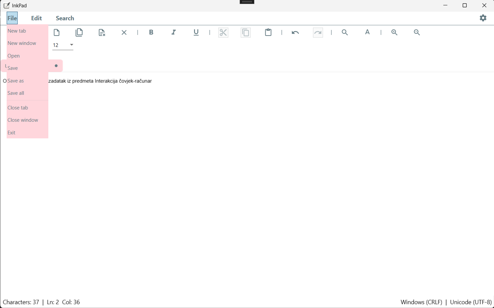

• Through the **Edit** options of the menu item, the user can restore the previously deleted part of the text, can cut, copy, paste and delete part of the text and can select the entire text and insert the current date and time.

 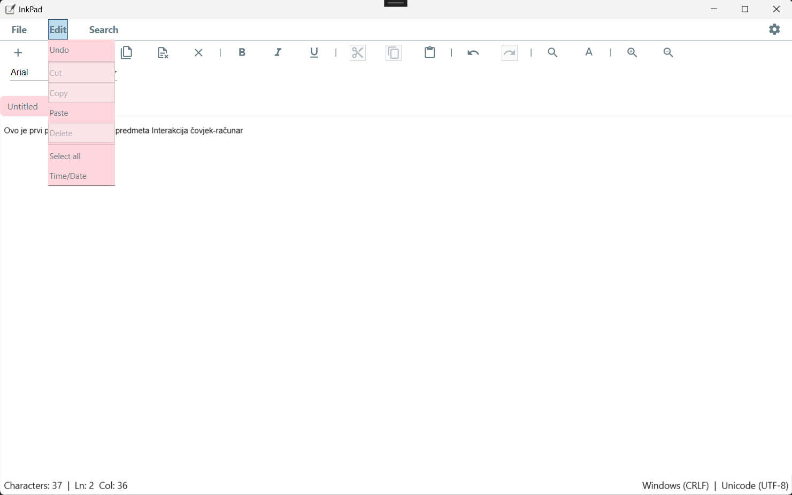
 

• Through the **Search** options of the menu item, the user can find the number of occurrences of a certain pattern and replace a certain part of the text with the desired pattern.

 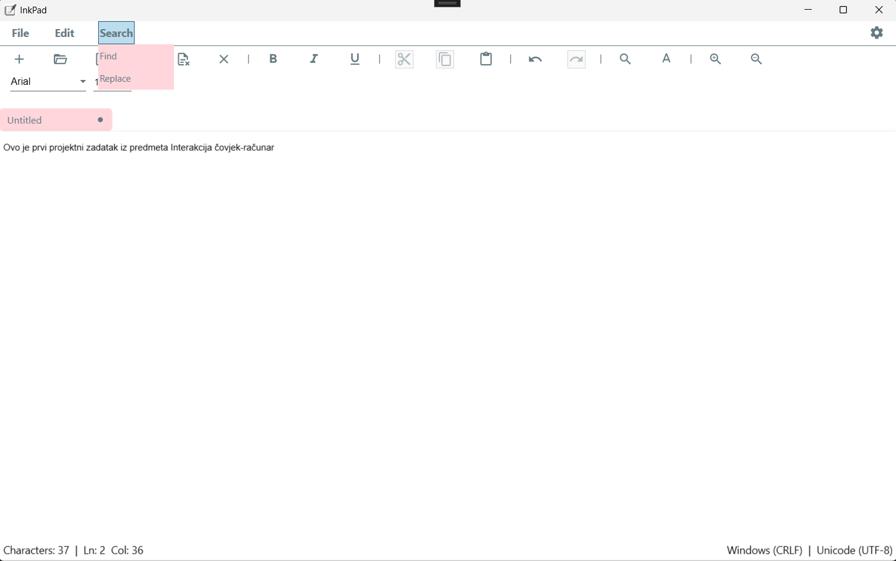

The desired font and font size can be applied to the selected text.

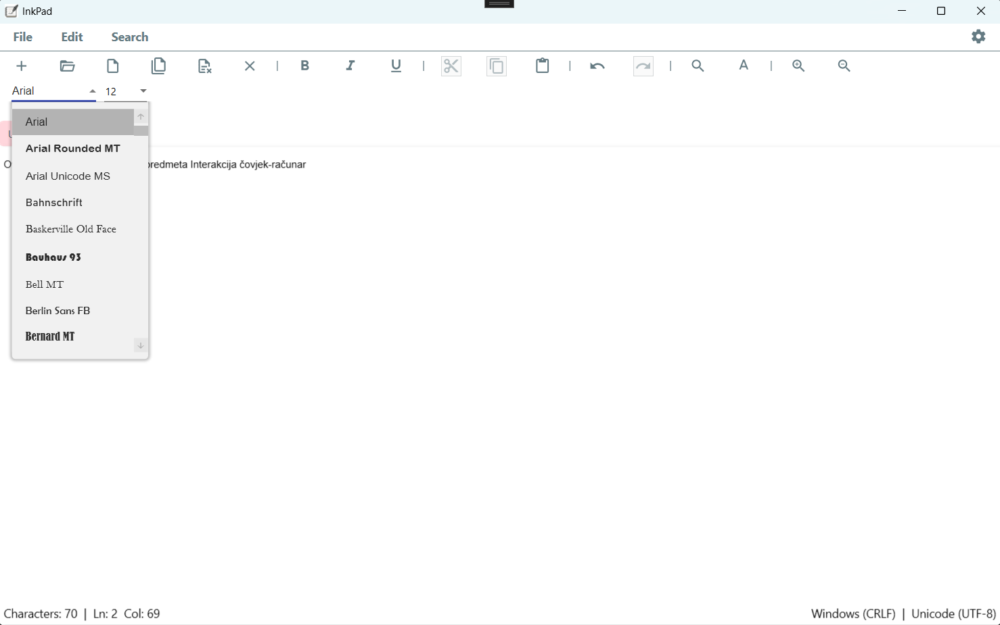

The selected text can be made bold, italic and underlined.

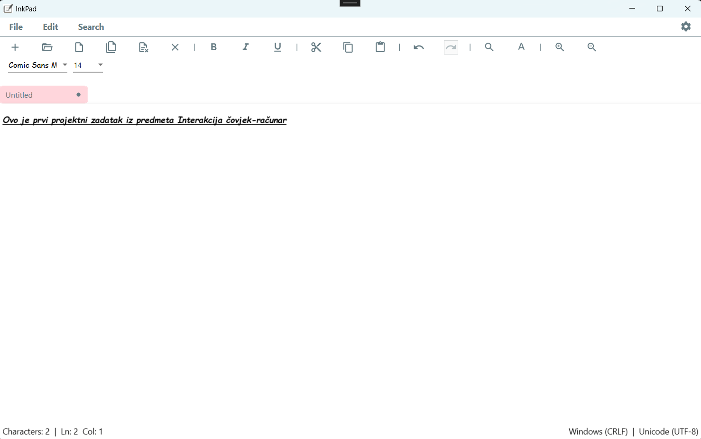

The user can speed up his work by using shortcuts from the lower part of the menu offered by the application. In the shortcuts, additional options have been added: to save all unsaved changes of currently open files, to close all currently open files and for the user to enlarge or reduce the text. In addition, in the lower left corner is given a basic view of the current position of the text input. The user can then save the file to the computer.

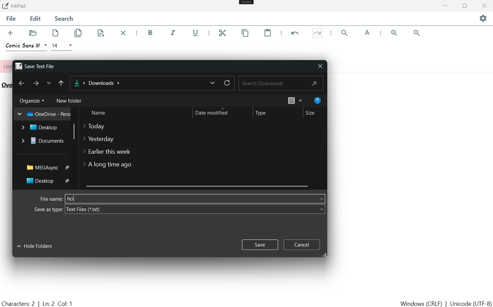

Also, the user can open an already existing file from the computer.

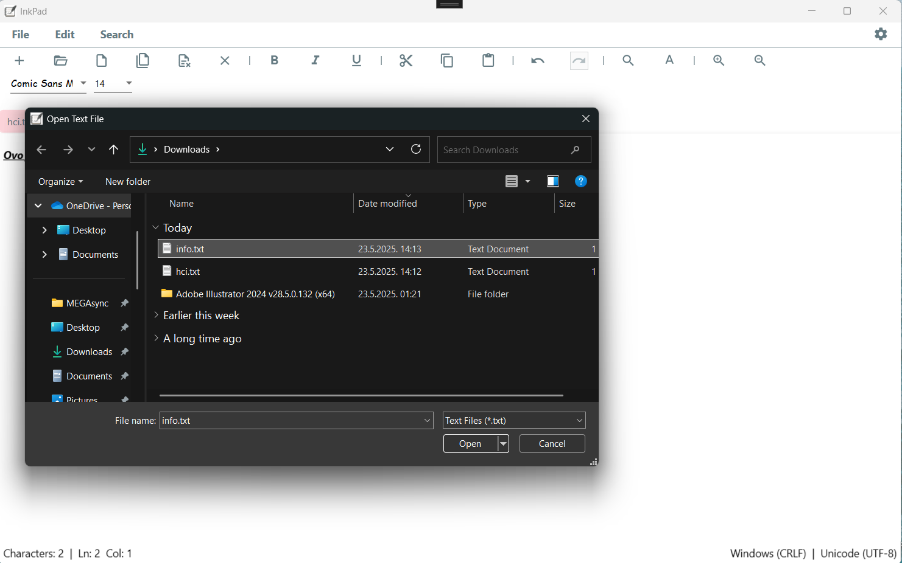

It is also possible to change the theme of the application.

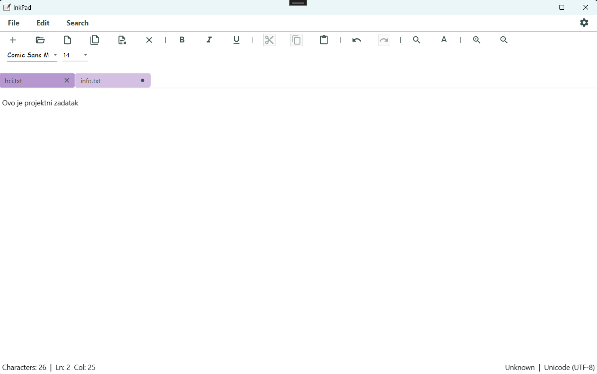

If the user changes the text file without saving it, he gets a notification where he should choose whether to save the changes to the file or discard them.

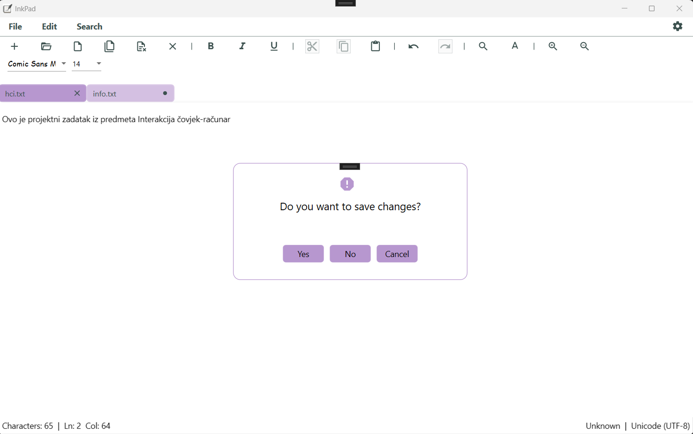

By entering the desired pattern, the number of its appearance is obtained.

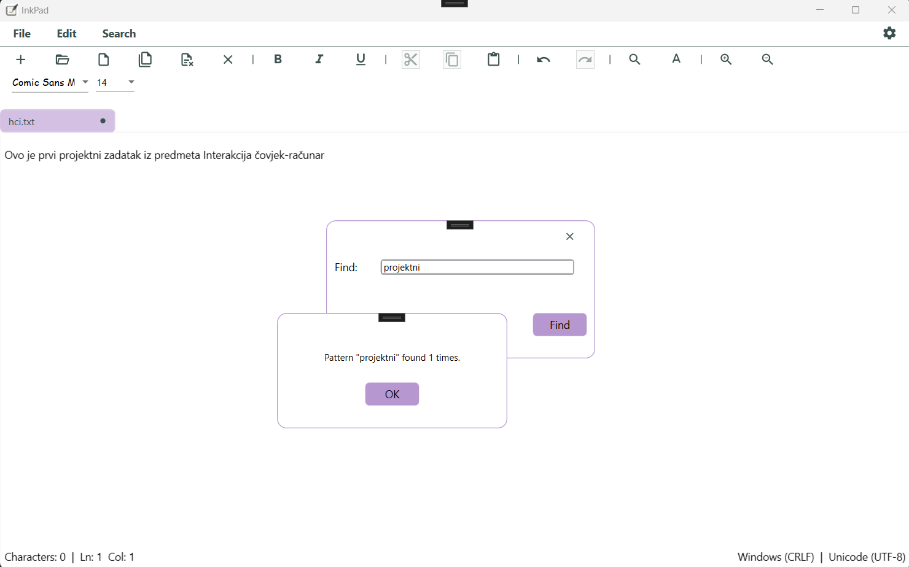

Simple replacement of one part of the text with another is also possible.

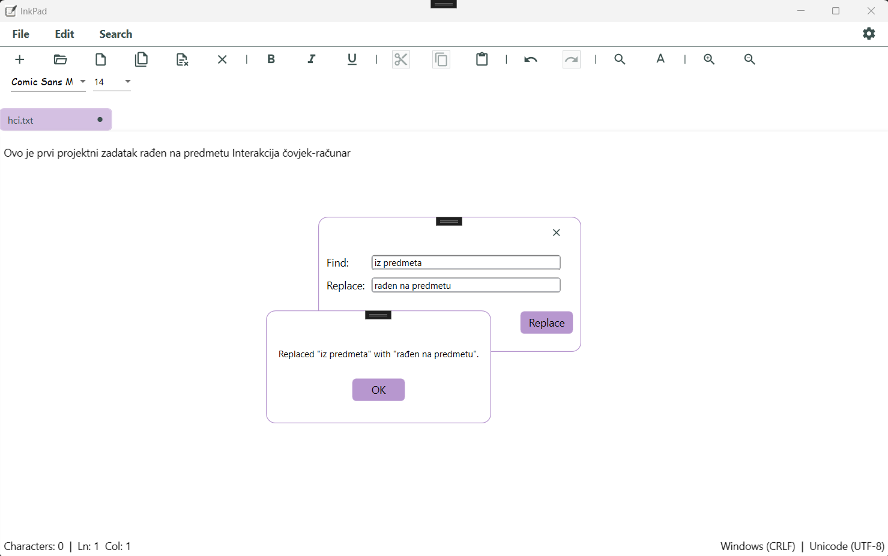